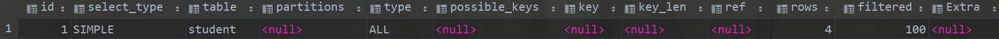

# explain语句返回各列含义

| 列名          | 含义                                       |
| ------------- | ------------------------------------------ |
| id            | 每个select都有一个对应的id号, 并且         |
| select type   | 查询语句执行的查询操作类型                 |
| table         | 表名                                       |
| partitions    | 表分区情况                                 |
| **type**      | 查询所用的类型                             |
| possible_keys | 可能用到的索引                             |
| key           | 实际查询用到的索引                         |
| key_len       | 所使用到的索引长度                         |
| ref           | 使用到索引时, 与索引进行等值匹配的列或常量 |
| rows          | 预计扫描的行数(索引行数或者记录行数)       |
| filtered      | 表示符合查询条件的数据百分比               |
| extra         | SQL执行的额外信息                          |

