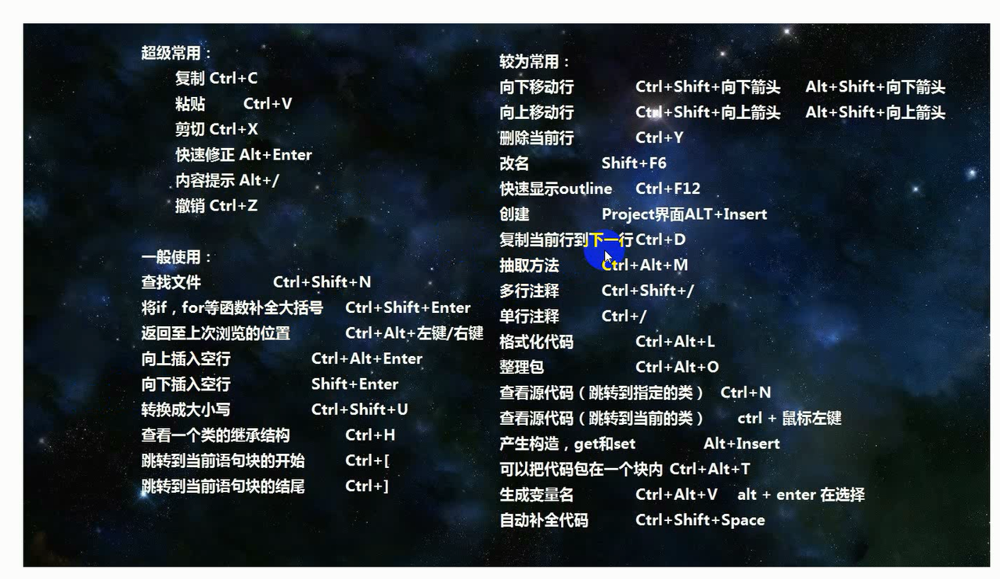
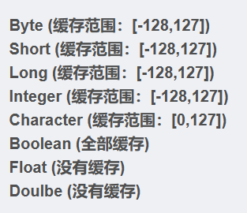
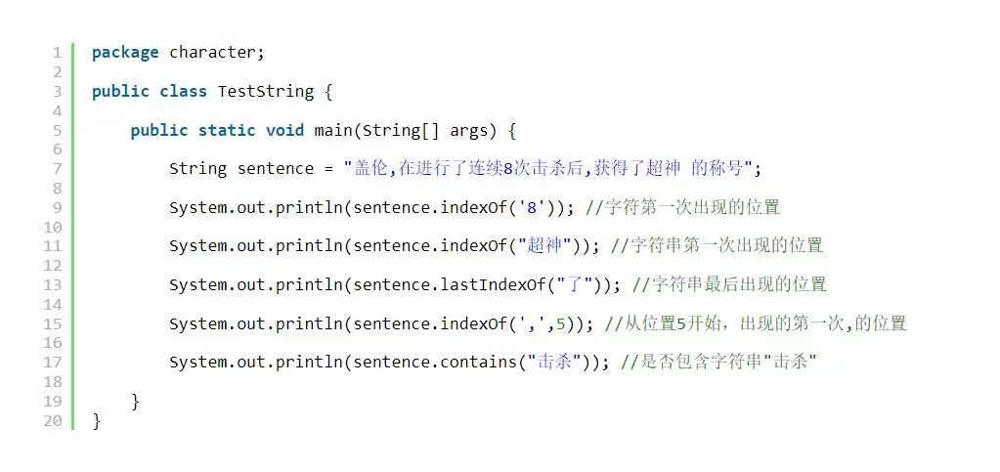
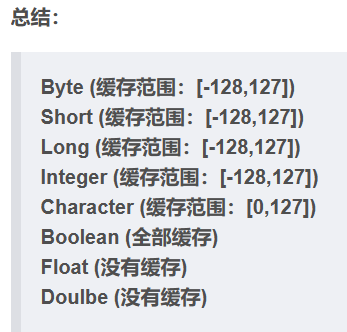
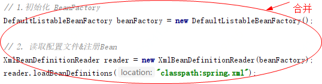
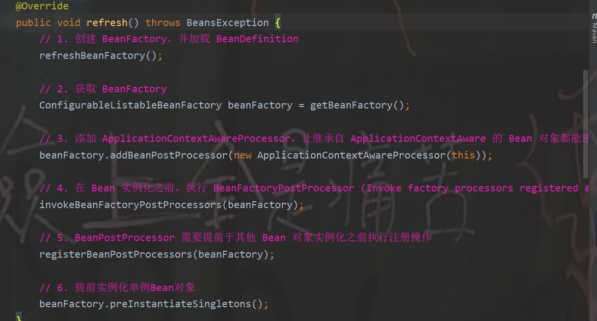
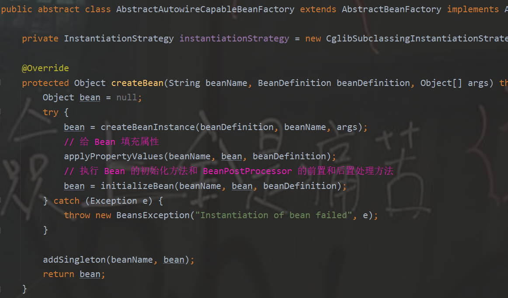

# 笔记

## IDEA快捷键



## 回溯算法的时间复杂度

==**一般说道回溯算法的复杂度，都说是指数级别的时间复杂度，这也算是一个概括吧**==

1. 子集问题分析：

时间复杂度： $O(n\times2^n)$。因为每一个元素的状态无外乎取与不取，一共$2^n$种状态，每种状态都需要$O(n)$的构造时间，最终时间复杂度为$O(n\times2^n)$。

空间复杂度：$O(n)$，递归深度为n，所以系统栈所用空间为$O(n)$ 。每一层递归所用的空间都是常数级别，注意代码里的result和path都是全局变量，就算是放在参数里，传的也是引用，并不会新申请内存空间，最终空间复杂度为$O(n)$。

2. 排列问题分析：

时间复杂度： $O(n\times n!)$ 。因为一共$n!$ 种排列，每种排列都需要$O(n)$的构造时间，最终时间复杂度为$O(n\times n!)$ 。

空间复杂度： $O(n)$，和子集问题同理。

3. 组合问题分析：

时间复杂度：$O(C^k_n \times k)$，总共有$C^k_n$种组合，每种组合需要 $O(k)$的时间复杂度。另一方面，组合问题其实就是一种子集的问题，所以组合问题最坏的情况，也不会超过子集问题的时间复杂度 $O(n\times2^n)$ 。

空间复杂度： $O(n)$ ，和子集问题同理。

4. N皇后问题分析

时间复杂度： $O(N!)$ ，其中 N 是皇后数量，由于每个皇后必须位于不同列，因此已经放置的皇后所在的列不能放置别的皇后。第一个皇后有 N 列可以选择，第二个皇后最多有 N-1列可以选择...。

空间复杂度：$O(n)$ ，和子集问题同理。

5. 解数独问题分析

时间复杂度：$O(9^m)$ ，m是'.'的数目。

空间复杂度：$O(n^2)$，n是数独盘子的大小，递归的深度是 $O(n^2)$。

## 背八股的网站

* 力扣刷题

  > [CS-Notes (cyc2018.xyz)](http://www.cyc2018.xyz/#算法)
  >
  > [代码随想录 (programmercarl.com)](https://www.programmercarl.com/)
  >
  > 剑指offer

* 背八股

  > 任中杰说师兄推荐的[JavaGuide（Java学习&&面试指南） | JavaGuide(Java面试+学习指南)](https://javaguide.cn/home.html)
  >
  > [小林coding (xiaolincoding.com)](https://www.xiaolincoding.com/)
  >
  > [【Java工程师面试宝典】学习说明_互联网校招面试真题面经汇总_牛客网 (nowcoder.com)](https://www.nowcoder.com/issue/tutorial?tutorialId=94&uuid=b479698283ed4a36a0ff3e53e54794ff)
  >
  > [目录 | 阿秀的学习笔记 (interviewguide.cn)](https://interviewguide.cn/notes/01-guide/web-guide-reading.html#一、本站知识速览)
  >
  > [Java面试小抄 (javalearn.cn)](https://www.javalearn.cn/#/README)
  >
  > 费师兄介绍的关于mysql的[路途博客 (dhc.pythonanywhere.com)](https://dhc.pythonanywhere.com/entry/share/?key=12e4a7324f68371db3984d93e26e458962a4f0bc188ec23ec70637a4f3b4d58f)

* 制作简历

  > [超级简历WonderCV - HR推荐简历模板,智能简历制作工具,专业中英文简历模板免费下载](https://www.wondercv.com/cvs/HhX6yFA/editor)
  >
  > [知页简历-名企精英简历模板,专业简历制作工具,简历模板免费下载,免费在线简历制作 (zhiyeapp.com)](https://www.zhiyeapp.com/)
  >
  > [职徒简历52cv-免费简历模板下载|中英文简历模板|智能求职简历工具](https://www.52cv.com/)

* 学java的

  > 任中杰学java的网站[How2J 的 Java教程](https://how2j.cn/)

* 师兄发的学mysql的博客

  > https://dhc.pythonanywhere.com/entry/share/?key=12e4a7324f68371db3984d93e26e458962a4f0bc188ec23ec70637a4f3b4d58f

## 计算机网络

应用层工作在操作系统的**用户态**, 传输层及以下则工作在**内核态**。

### ARP

**ARP属于网络层协议，和IP是一层**
ARP的作用在于找到IP主机对应的MAC地址，之后开始传输数据，具体流程如下
首先，每个主机都会在自己的ARP缓冲区中建立一个ARP列表，以表示IP地址和MAC地址之间的对应关系。
当源主机要发送数据时，首先检查ARP列表中是否有对应IP地址的目的主机的MAC地址，如果有，则直接发送数据，如果没有，就向本网段的所有主机发送ARP数据包，该数据包包括的内容有：源主机 IP地址，源主机MAC地址，目的主机的IP 地址。
当本网络的所有主机收到该ARP数据包时，首先检查数据包中的IP地址是否是自己的IP地址，如果不是，则忽略该数据包，如果是，则首先从数据包中取出源主机的IP和MAC地址写入到ARP列表中，如果已经存在，则覆盖，然后将自己的MAC地址写入ARP响应包中，告诉源主机自己是它想要找的MAC地址。
源主机收到ARP响应包后。将目的主机的IP和MAC地址写入ARP列表，并利用此信息发送数据。如果源主机一直没有收到ARP响应数据包，表示ARP查询失败。
广播发送ARP请求，单播发送ARP响应。


## JAVA基础、常用API

boolean的大小是1字节, 虽然只用一个比特位就能表达真假, 但是处理数据的基本单位是一个字节, 剩下的7个比特位当做对齐填充

### 包装类的缓存池

```java
// 装箱:方式1
Integer num1 = new Integer(123);
Integer num2 = new Integer(123);
System.out.println(num1==num2); // false

//装箱:方式2
Integer num3 = Integer.valueOf(123);
Integer num4 = Integer.valueOf(123);
System.out.println(num3==num4); // true

// 自动装箱
Integer num5 = 123;
Integer num6 = 123;
System.out.println(num5==num6); // true

System.out.println("-------------------------------------");

// 装箱:方式1
Integer num11 = new Integer(250);
Integer num22 = new Integer(250);
System.out.println(num11==num22); // false

//装箱:方式2
Integer num33 = Integer.valueOf(250);
Integer num44 = Integer.valueOf(250);
System.out.println(num33==num44); // fasle

// 自动装箱
Integer num55 = 250;
Integer num66 = 250;
System.out.println(num55==num66); // false
```

自动装箱其实底层也是调用的Integer.valueOf()而不是new Integer()

[包装类中的缓存设计（享元模式：Flyweight Pattern）_包装类型的缓存_向上的狼的博客-CSDN博客](https://blog.csdn.net/m0_50370837/article/details/124060356)



### ==Arrays.sort重写排序规则==, 以及优先级队列

gpt记录: 黄甜甜第二题

```java
 Arrays.sort(tasks, Comparator.comparingInt(a -> a[1]));//这是什么意思
```

### final finally finalize

final:

> **final修饰类**表示该类不可被继承, 所以一个类不能同时被声明为abstract和final. final类的成员变量可以根据需要设为final, 但其中的成员方法都会被隐式地指定为final方法
>
> **final修饰方法**可以被继承和重载, 但不能被重写 
>
> 题外话: static方法可以被重写吗? 不能被重写, 如果子类中也含有一个返回类型、方法名、参数列表均与之相同的静态方法，那么该子类实际上只是将父类中的该同名方法进行了隐藏，而非重写。 [final修饰的方法能否被继承？能否被重载？能否被重写？final修饰的类能否被继承？_被final修饰的方法不能被继承_eather_liang的博客-CSDN博客](https://blog.csdn.net/lgf15279707407/article/details/94490007)
>
> **final修饰成员变量**表示常量, 只能被赋值一次, 赋值后值不再改变. **final修饰一个成员变量（属性），必须要显示初始化。**这里有两种初始化方式
>
> * 一种是在变量声明的时候初始化；
> * 第二种方法是在声明变量的时候不赋初值，但是要在这个变量所在的类的所有的构造函数中对这个变量赋初值。
>
> 　　当函数的参数类型声明为final时，说明该参数是只读型的。即你可以读取使用该参数，但是无法改变该参数的值。
>
> [【Java学习笔记之二十】final关键字在Java继承中的用法小结 - DWVictor - 博客园 (cnblogs.com)](https://www.cnblogs.com/DWVictor/p/10507677.html#:~:text=final修饰的,l修饰的方法）。)

### 保留两位小数

[Java怎么保留两位小数（format、BigDecimal、DecimalFormat）_decimalformat保留两位小数_何学长在奔跑的博客-CSDN博客](https://blog.csdn.net/weixin_44170221/article/details/104682774)

```java
一、String.format
double d1 = 6.6666;
double d2 = 8.88888;
double d3 = 3;
System.out.println(String.format("%.2f", d1));//设置保留两位小数
System.out.println(String.format("%.2f", d2));
System.out.println(String.format("%.2f", d3));
//注意：没有小数位或者小数位不够你设置的保留数时，自动补0

二、DecimalFormat
double d1 = 6.6666;
double d2 = 8.88888;
double d3 = 3;
DecimalFormat df = new DecimalFormat("#.00");//设置保留两位小数
System.out.println(df.format(d1));
System.out.println(df.format(d2));
System.out.println(df.format(d3));

三、BigDecimal
```

### 关于反射

[Java反射机制-十分钟搞懂 - 知乎 (zhihu.com)](https://zhuanlan.zhihu.com/p/405325823)

### 关于泛型

泛型类, 泛型方法, 泛型接口

[Java泛型中的类型擦除详解 - 知乎 (zhihu.com)](https://zhuanlan.zhihu.com/p/346486993)

Java的泛型是伪泛型，这是因为Java在编译期间，所有的泛型信息都会被擦掉.

类型检查是针对谁的呢?  类型检查就是编译时完成的. 而真正设计类型检查的是它的引用，因为我们是使用它引用`list1`来调用它的方法，比如说调用`add`方法，所以`list1`引用能完成泛型类型的检查。

类型检查就是针对引用的，谁是一个引用，用这个引用调用泛型方法，就会对这个引用调用的方法进行类型检测，而无关它真正引用的对象

优点: 

1. 类型安全. 编译前检查, 而不是抛出ClassCastException
2. 提高代码的可重用性
3. 消除强制类型转换, 不用转换类型了

缺点:

1. 编译时泛型擦除(避免泛型爆炸? 我认为), 反射可以破坏泛型检查
2. 类信息会在编译时丢失


为什么要进行泛型擦除?

1. 兼容旧代码

2. 虚拟机不用处理和理解泛型类的具体信息

3. 性能优化, 减少运行时需要处理的信息量

   

## String

### api



### 字符串数组打印

``` java
String[] strs = {"sab", "qqw", "fsa"};
System.out.println(strs);//[Ljava.lang.String;@776ec8df
System.out.println(Arrays.toString(strs));//[sab, qqw, fsa]
System.out.println(Arrays.deepToString(strs));//[sab, qqw, fsa]
System.out.println(Arrays.asList(strs));//[sab, qqw, fsa]
System.out.println(String.join(" ",strs))//sab qqw fsa ```
```

## 数据结构

## 小根堆

[小根堆创建，插入，删除，排序等操作图解_你今天真好看+1的博客-CSDN博客](

## Spring

### 基于Cglib实现 含构造函数的类的 实例化策略:

1. 根据传入的beanDefination找到Class
2. 根据Class反射找到constructors
3. 遍历constructors找到和传入的参数Object[] args==数量==(实际Spring 源码中还需要比对入参类型，否则相同数量不同入参类型的情况，就会抛异常了)匹配的构造函数

### JDK动态代理和CGLib动态代理的区别

* Spring 中 Aop 的实现

  1. 如果代理对象有接口，就用 JDK 动态代理。JDK 动态代理是利用反射机制生成一个实现代理接口的匿名类，在调用具体方法时，会先调用实现了 InvokeHandler 接口的 invoke() 方法，来实现业务增强
  2. 如果代理对象没有接口，那么就直接使用 Cglib 动态代理。Cglib 动态代理是利用 asm 开源包，对代理对象类的 class 文件加载进来，通过修改其字节码生成子类来处理

* Spring 中的 AOP，有接口就用 JDK 动态代理，没有接口就用 Cglib 动态代理；并优先使用 JDK 动态代理
  SpringBoot 中的 AOP，在 2.0 版本之前和 Spring 一样
  SpringBoot 中的 AOP，在 2.0 版本之后首选 Cglib 动态代理，如果用户想要使用 JDK 动态代理，需要自己手动配置

* 我们可以强制使用CGLIB，指定proxy-target-class = "true" 或者 基于注解@EnableAspectJAutoProxy(proxyTargetClass = true)

* JDK动态代理是面向==接口==的, 没有接口那JDK代理没办法。

  CGLib动态代理是通过字节码底层继承要代理类来实现，因此如果被代理类被==final==关键字所修饰，会失败。

* 如果要被代理的对象是个实现类，那么Spring会使用JDK动态代理来完成操作（Spirng默认采用JDK动态代理实现机制）；

  如果要被代理的对象不是个实现类那么，Spring会强制使用CGLib来实现动态代理。

### Spring事务失效?

[同一个类中，事务方法调用无事务方法，事务是否生效的问题_同一个类中有事务调用无事务_客气的圣光野牛的博客-CSDN博客](https://blog.csdn.net/qq_45810981/article/details/122307983)

[spring 事务失效的 12 种场景_duplicatekeyexception事物会生效吗_hanjq_code的博客-CSDN博客](https://blog.csdn.net/hanjiaqian/article/details/120501741)

* > 

https://blog.csdn.net/Zj_boring/article/details/105157360)

https://blog.csdn.net/m0_50370837/article/details/124060356)




| 包装类型  | 基本数据类型 | 缓存对象（基本数据类型值） |
| --------- | ------------ | -------------------------- |
| Boolean   | boolean      | true,false（全部值）       |
| Byte      | byte         | -128~127（全部值）         |
| Short     | short        | -128~127                   |
| Character | char         | 0~127                      |
| Integer   | int          | -128~127（默认为127）      |
| Long      | long         | -128~127                   |
| Float     | float        | 无缓存值                   |
| Double    | double       | 无缓存值                   |

## JUC

### 线程通信?同步?

通信:

1. synchronized的wait和notify或者notifyAll
2. ReentrantLock结合Condition的await和signal或者signalAll

同步:

1. synchronized关键字
2. ReentrantLock锁

### 三个线程交替打印1到100

1. wait和notifyall
2. semaphore的acquire和release
3. Executors.newFixedThreadPool(3)线程池
4. coutdownlatch?这个可以吗????

### readwritelock

与传统锁不同的是读写锁的规则是可以共享读，但只能一个写，总结起来为：`读读不互斥，读写互斥，写写互斥`，而一般的独占锁是：`读读互斥，读写互斥，写写互斥`，而场景中往往**读远远大于写**，读写锁就是为了这种优化而创建出来的一种机制。注意是`读远远大于写`，一般情况下独占锁的效率低来源于高并发下对临界区的激烈竞争导致线程上下文切换。因此当并发不是很高的情况下，读写锁由于需要额外维护读锁的状态，可能还不如独占锁的效率高。因此需要根据实际情况选择使用。
链接：https://www.jianshu.com/p/f0b4e4a0624d

## MySQL

### MySQL加锁语句

* 表级锁

  * 表锁 

    * > 加锁语句: lock tables 表名... read/write。
      >
      > 释放锁语句: unlock tables / 客户端断开连接 。
      >
      >  读锁不会阻塞其他客户端的读，但是会阻塞写。写锁既会阻塞其他客户端的读，又会阻塞其他客户端的写。

    * 表共享读锁（read lock）

    * 表独占写锁（write lock）

  * 意向锁

    * > 意向共享锁(IS): 由语句select ... lock in share mode添加 。 与表锁共享锁 (read)兼容，与表锁排他锁(write)互斥。 
      >
      > 意向排他锁(IX): 由insert、update、delete、select...for update添加 。与表锁共享锁(read)及排他锁(write)都互斥，意向锁之间不会互斥。
      >
      > 一旦事务提交了，意向共享锁、意向排他锁，都会自动释放。

    * 意向共享锁(==IS==)

    * 意向排他锁(==IX==)

  * 元数据锁

* 行锁 **InnoDB的数据是基于==索引==组织的，行锁是通过对索引上的索引项加锁来实现的，而不是对记录加的锁。**

  * 行锁/记录锁（Record Lock）：锁定单个行记录的锁，防止其他事务对此行进行update和delete。在 RC、RR隔离级别下都支持。

    * | SQL                           | 行锁类型   | 说明                                     |
      | :---------------------------- | ---------- | ---------------------------------------- |
      | INSERT ...                    | 排他锁     | 自动加锁                                 |
      | UPDATE ...                    | 排他锁     | 自动加锁                                 |
      | DELETE ...                    | 排他锁     | 自动加锁                                 |
      | SELECT（正常）                | 不加任何锁 |                                          |
      | SELECT ... LOCK IN SHARE MODE | 共享锁     | 需要手动在SELECT之后加LOCK IN SHARE MODE |
      | SELECT ... FOR UPDATE         | 排他锁     | 需要手动在SELECT之后加FOR UPDATE         |

    * （1）记录锁, 仅仅锁住索引记录的一行，在单条索引记录上加锁。
      （2）record lock锁住的永远是索引，而非记录本身，即使该表上没有任何索引，那么innodb会在后台创建一个隐藏的聚集主键索引，那么锁住的就是这个隐藏的聚集主键索引。
      所以说当一条sql没有走任何索引时，那么将会在每一条聚合索引后面加X锁，这个类似于表锁，但原理上和表锁应该是完全不同的。

  * 间隙锁（Gap Lock）：锁定索引记录间隙（不含该记录），确保索引记录间隙不变，防止其他事务在这个间隙进行insert，产生幻读。在RR隔离级别下都支持。

  * 临键锁（Next-Key Lock）：行锁和间隙锁组合，同时锁住数据，并锁住数据==前面==的间隙Gap。 在RR隔离级别下支持。


[Mysql锁详解（行锁、表锁、意向锁、Gap锁、插入意向锁）_mysql 插入意向锁_Helloworld先生的博客-CSDN博客](https://blog.csdn.net/u010841296/article/details/84204701)

### 意向锁

为了避免DML在执行时，加的行锁与表锁的冲突，在InnoDB中引入了意向锁，使得表锁不用检查每行数据是否加锁，使用意向锁来减少表锁的检查。

意向锁是一种不与行级锁冲突的**表级锁**

- **意向共享锁**（intention shared lock, IS）：事务有意向对表中的某些行加**共享锁**（S锁）

```text
-- 事务要获取某些行的 S 锁，必须先获得表的 IS 锁。
SELECT column FROM table ... LOCK IN SHARE MODE; 
```

- **意向排他锁**（intention exclusive lock, IX）：事务有意向对表中的某些行加**排他锁**（X锁）

```text
-- 事务要获取某些行的 X 锁，必须先获得表的 IX 锁。
SELECT column FROM table ... FOR UPDATE; 
```

即：意向锁是有数据引擎自己维护的，用户无法手动操作意向锁，在为数据行加共享 / 排他锁之前，InooDB 会先获取该数据行所在在数据表的对应意向锁。

| 是否兼容        | 当事务A上了: IS   | IX                | S                 | X                 |
| --------------- | ----------------- | ----------------- | ----------------- | ----------------- |
| 事务B能否上: IS | 是                | 是                | 是                | $\color{red}{否}$ |
| IX              | 是                | 是                | $\color{red}{否}$ | $\color{red}{否}$ |
| S               | 是                | $\color{red}{否}$ | 是                | $\color{red}{否}$ |
| X               | $\color{red}{否}$ | $\color{red}{否}$ | $\color{red}{否}$ | $\color{red}{否}$ |

**注意：这里的排他 / 共享锁指的都是表锁！！！意向锁不会与行级的共享 / 排他锁互斥！！！**

总结

1. InnoDB 支持多粒度锁，特定场景下，行级锁可以与表级锁共存。
2. 意向锁之间互不排斥，但除了 IS 与 S 兼容外，意向锁会与 共享锁 / 排他锁 互斥。
3. IX，IS是表级锁，不会和行级的X，S锁发生冲突。只会和表级的X，S发生冲突。
4. 意向锁在保证并发性的前提下，实现了行锁和表锁共存且满足事务隔离性的要求。

[详解 MySql InnoDB 中意向锁的作用 - 知乎 (zhihu.com)](https://zhuanlan.zhihu.com/p/185003485)

## JVM

### 垃圾回收器

[面试官常问的垃圾回收器，这次全搞懂 - 知乎 (zhihu.com)](https://zhuanlan.zhihu.com/p/347245583)

### 频繁发生full gc的原因?

[频繁发生fullgc的原因和定位思路_fullgc频繁的原因_请把小熊还给我&的博客-CSDN博客](https://blog.csdn.net/qq_42058998/article/details/124922958?spm=1001.2101.3001.6650.1&utm_medium=distribute.pc_relevant.none-task-blog-2~default~CTRLIST~Rate-1-124922958-blog-115607497.235^v38^pc_relevant_sort_base2&depth_1-utm_source=distribute.pc_relevant.none-task-blog-2~default~CTRLIST~Rate-1-124922958-blog-115607497.235^v38^pc_relevant_sort_base2&utm_relevant_index=2)

### ==各种命令如jstat等==

## Redis

### 为什么Redis那么快

1. **内存存储:** 没有磁盘IO的的开销. 数据在内存中类似于hashmap, 因为redis本身就是k-v的数据库, 查找和操作的复杂度都是O(1)
2. **单线程实现:** 6.0之前, 使用单线程处理请求, 避免了多个线程之间的切换和锁资源争用的开销. 6.0之后, 在读取用户指令和写回?(记不清了)时用的是多线程, 但处理命令的核心线程还是单线程
3. **非阻塞IO:** IO多路复用, 使用epoll实现, 再加上Redis自身的事件处理模型将epoll中的连接、读写、关闭都转换为事件，不在网络I/O上浪费过多的时间。
4. 优化的数据结构
5. 使用的底层模型不同

### ==为什么用redis做缓存不用别的?==

Redis优点:

- 每秒可以处理超过10万次读写操作;

- 支持AOF和RDB两种数据持久化方式。

- 支持事务

- 数据结构丰富

- 支持主从复制, 读写分离

  缺点

* 受到物理内存的限制, 不能用作海量数据的高性能读写
* 主机宕机，宕机前有部分数据未能及时同步到从机，切换IP后还会引入数据不一致的问题，降低了系统的可用性

Redis vs Memcached

- 数据类型：Memcached所有的值均是简单的字符串，Redis支持更为丰富的数据类型，支持string(字符串)，list(列表)，Set(集合)、Sorted Set(有序集合)、Hash(哈希)等。

- 持久化：Redis支持数据落地持久化存储，可以将内存中的数据保持在磁盘中，重启的时候可以再次加载进行使用。 memcache不支持数据持久存储 。

- 集群模式：Redis提供主从同步机制，以及 Cluster集群部署能力，能够提供高可用服务。Memcached没有原生的集群模式，需要依靠客户端来实现往集群中分片写入数据

- 性能对比：Redis的速度比Memcached快很多。

- 网络IO模型：Redis使用单线程的多路 IO 复用模型，Memcached使用多线程的非阻塞IO模式。

- Redis支持服务器端的数据操作：Redis相比Memcached来说，拥有更多的数据结构和并支持更丰富的数据操作，通常在Memcached里，你需要将数据拿到客户端来进行类似的修改再set回去。

  这大大增加了网络IO的次数和数据体积。在Redis中，这些复杂的操作通常和一般的GET/SET一样高效。所以，如果需要缓存能够支持更复杂的结构和操作，那么Redis会是不错的选择。

**从高并发上来说：**

- 直接操作缓存能够承受的请求是远远大于直接访问数据库的，所以我们可以考虑把数据库中的部分数据转移到缓存中去，这样用户的一部分请求会直接到缓存这里而不用经过数据库。

**从高性能上来说：**

- 用户第一次访问数据库中的某些数据。 因为是从硬盘上读取的所以这个过程会比较慢。将该用户访问的数据存在缓存中，下一次再访问这些数据的时候就可以直接从缓存中获取了。操作缓存就是直接操作内存，所以速度相当快。如果数据库中的对应数据改变的之后，同步改变缓存中相应的数据。

### ==为什么用redis做分布式锁不用别的?==

[花5min就能搞清楚redis和zookeeper分布式锁的区别，太有必要读一下了 - 知乎 (zhihu.com)](https://zhuanlan.zhihu.com/p/112907568)

[Zookeeper和Redis实现的分布式锁的区别，应用场景（字节一面，阿里中间件面试题）_zookeeper和redis选择及使用场景_梁 锋的博客-CSDN博客](https://blog.csdn.net/qq_22256565/article/details/104147826#:~:text=Zookeeper的分布式锁是客户端基于创建临时节点实现的，对于排他锁，每个客户端都尝试创建临时节点，但是只有一个客户端能成功创建，创建成功则相当于获取了锁。 对于共享锁，则会按照一定的顺序队列创建带序号的临时节点并尝试获取锁（可以有多个客户端获取共享锁）。,Redis的分布式锁则是通过创建一个从未创建过的key并设置其过期时间实现的，创建成功则获得了锁，并且客户端会在一定时间内循环获取锁，比较消耗服务器性能。 Zookeeper释放锁时，要么正常执行完业务逻辑后，事务主动释放，要么是检测到与客户端的会话失效后释放。 Redis释放锁时，要么正常执行完业务逻辑后，事务主动释放，要么是键超时后释放锁。)

### ==分片集群相关==

[Redis-集群搭建(cluster集群、集群创建、节点配置、节点添加、节点删除、槽位分配)_redis cli连接集群节点_JolyouLu的博客-CSDN博客](https://blog.csdn.net/weixin_44642403/article/details/118885921)

[Redis Cluster数据分片实现原理、及请求路由实现-CSDN博客](https://blog.csdn.net/Seky_fei/article/details/107611850)


# 面试

## 要准备的问题

1. 自己的优缺点
2. 项目中遇到的困难? 怎么解决的? 有什么收获?

## 科大讯飞

* 为什么选择科大讯飞? 
  * 科大讯飞在中国智能语音市场占据第一的位置, 因为做语音的, 发展前途好, 智能家居 语音助手什么的

* 职业规划?
  * 二面的时候面试官给我介绍了专项研发技术路线和横向的技术管理路线，三面面试官说科大讯飞鼓励员工全面发展；那短期来说，我希望能够多与团队成员交流，参与项目，尽快熟悉科大讯飞的工作环境和开发流程，积极学习；长期来说，我希望能够拓宽自己的技术广度，培养自己的领导力，全面发展，争取能够晋升为研发组长、总监这样的职位带领团队做项目
* 遇到最大的挫折?
  * 程序遇到bug, 复杂的层层调用, 上网查发现不解决问题,查到底层发现是配置文件里的连接信息出错了 .  总结  配置的东西用copy的, 检查错误的时候先从项目配置文件入手, 下次遇到类似的问题就有经验了
  * 入学时候导师直接丢给我一个需求, 我硬看代码, 发现效率低下然后求助师兄, 师兄说不必在乎太底层的细节, 要知道主要逻辑是怎么运行的, 也就是抓住主要矛盾. 总结: 遇到生疏的问题不要一来就闷头苦干, 先总览地看到整体, 抓住主要矛盾, 实在不懂的也不要瞎干, 要懂得及时求助外界帮助.
  * 
* 最有成就感的事?
  * 老师的项目上线正式投入生产使用了, 前前后后几个月时间编写的程序终于落地了
* 觉得自己优点?缺点?
  * 优点: 遇到事情不会慌张, 很冷静, 思考事情的时候会思考得比较细致, 会做好最坏的兜底打算, 但以百分百的努力去完成任务, 不让坏的后果发生.  实际上情况都会比预想的最坏情况要好, 这样慢慢的我的承受能力, 抗压能力也增强了
  * 缺点: 有点拖延, 但是我现在都会先把大任务拆分成小任务, 然后列一个备忘录, 列一个计划来克服这种毛病
         有点不懂拒绝, 之后我会在这方面提升下自己的沟通能力, 安排好自己的计划, 尽量不被影响
* base地有什么想法?为什么选择来合肥
  * 合肥省会城市发展机会多, 资源丰富, 并且不像北上广深那样节奏过于快了, 而且可以用更低的生活成本换取更高的生活质量, 这不是有科大讯飞在嘛
* 反问:?
  1. 对应届生有什么培训体系吗? 
  2. 岗位是怎么评估绩效的,需要达到什么指标 ?
  3. 岗位晋升看的是什么?

* 期望薪资: 看往年的别人的基本是22k x 14
  * 我期望27k x 14-16

### 四面终面高管vp面

* 反问：
  * 您最看重应届生的哪些方面


## 米哈游

1. 专业能力
2. 临场反应能力
3. 企业价值观考察 (1)是否玩过类似游戏 (2)玩过其他热门游戏并有思考? (3)企业价值观16个字,举例子证明,会加分


## 得物

### 一面2023.08.27 17:30 耗时半小时

给我说下你对Redis的理解(让面试官从我的回答中细问)(大问题)

MVCC怎么实现的(大问题)

readview?

G1和CMS选一个(G1)

说说你对G1的理解, 别背知识点(又是一个大问题, 我就说了1.内存分成一块块的region 2.Mixed GC)

G1这样做有什么好处, 他和其他垃圾回收器的区别在哪里

Young GC回收的话回收哪些地方的垃圾, 是都回收吗? Mixed GC的话呢? 具体回收哪些地方的垃圾

Redis分布式锁, 还了解过其他的吗? 为什么不用其他的比如zk, redis做分布式锁的优势在哪里

redis分布式锁里的数据结构(我说的redisson)

### 二面2023.09.02 16:50 耗时半小时

项目: MQ异步下单, 发生了一人多单,库存超卖问题怎么办呢? (说是不可调和的矛盾, 要一些就会舍弃一些? 异步的话, 处理好边界条件, 比如库存为0的情况) 答不上来

项目中学到了什么? redis还是rabbit还是mysql还是什么的?最能学到的一点是什么

手撕青蛙跳台阶

mysql索引? abcd四个字段, 对abc加联合索引, 问a>某个数 and  b=某个数索引失效吗

mysql索引结构? 为什么用B+树

mysql主从了解吗? 怎么实现的? 会出现什么问题

### 三面HR面2023.09.03 17:00 耗时20分钟

反问: 

1. 个人的晋升路径是怎么样的?

2. 您最看重应届生的哪方面能力呢

提前准备:

1. 为什么选择杭州?

* 因为杭州属于新一线城市, 潜力非常大, 发展较好, 资源多; 再者杭州是很宜居的城市, 我有和一个特别好的朋友就在杭州, 他很推荐我在这边定居,上有天堂下有苏杭嘛, 因为我来自贵州的一个小县城, 贵州经济不行, 加上家庭结构特殊, 我是很想离开家到更发达的城市来的

2. 职业规划

* 短期来说我的目标是希望能够多与团队成员交流，积极参与项目，尽快熟悉公司的工作环境和开发流程，积极学习；长期来说，我希望能够拓宽自己的技术广度，培养自己的领导力，全面发展，争取能够成为研发组长、总监这样的职位带领团队做项目

3. 三个词描述自己
4. 自己的优点和缺点

面试内容:

mysql主从复制会出现什么问题?主从延迟? 

为什么用B+树

redis和mysql一起用会出现什么问题? 双写不一致? 怎么解决(延时双删, mq异步)

你怎么看待java后端开发?架构?流程? 你怎么理解? 这个问题把我问蒙了

职业规划,要求一年怎么样两年怎么样三年怎么样

## 美团

### 一面2023.09.06 15:00 耗时1小时

1. 说说你项目中的亮点
2. 看你学过spring, 说说AOP
3. bean生命周期
4. 两个动态代理的区别, 在spring框架里是怎么用这两个动态代理的
5. redis有哪些数据结构, 什么场景用什么结构?
6. 数据库和缓存的一致性, 怎么保证双写一致? ==延时双删== 为什么删缓存不更新缓存? 要是删除失败了怎么办
7. 怎么保证MQ的消息可靠性
8. 缓存三兄弟
9. 垃圾回收器有哪些?
10. 堆区怎么划分的?
11. 一个对象从创建到进入老年代是怎么样的过程
12. 系统频繁发生full gc是什么情况? 用什么命令可以看垃圾回收情况
13. 结合代码说说栈区是怎么运行的? 创建过程? 栈里面放什么东西?
14. mysql索引怎么做优化
15. 创建索引有什么注意事项?
16. 索引数据结构?好处
17. 跳表是什么样子的? 
18. bitmap了解过吗?什么特征? 时间复杂度空间复杂度? 不会? 空间占用小?
19. 手撕反转链表
20. 平时怎么学习的? 看书看博客看视频?

反问:

* 技术栈?
  * spring, 缓存, 消息队列, jvm, 数据库, 数据结构与算法
* 应届生过来干什么样的工作?
  * 系统拆解, 大模块里面拆小模块, 子模块之类的

### 第二次一面2023.09.14 11:00 耗时40分钟

1. java学了多久就能上手了? 怎么样的方式去学习的
2. 遇到什么困难? 怎么发现这个困难的
3. 怎么发现redis分布式锁能解决这个问题的
4. redis是什么原理实现的分布式锁
5. ==对泛型怎么理解? java为什么要设计这个泛型?==
6. jdk和cglib动态代理的区别? 你用的是什么代理? 为什么用这个
7. 初始化的时候怎么解决bean的循环依赖?
8. concurrentHashMap怎么实现线程安全的?
9. 线程池用到过吗? 当时使用的拒绝策略是什么? 场景是什么? 为什么用这个策略?
10. ==使用主线程执行run方法的这个拒绝策略可以保证任务不丢失吗？==
11. 用的jdk什么版本? 使用的垃圾回收器是哪个? parallel
12. 怎么理解volatile关键字? 是怎么保证可见性的?
13. ==平时的什么场景会使用到volatile? jdk里面哪里用到volatile了?==
14. 数据库主键索引和非主键索引的区别? ==为什么要这么分呢?==
15. 用户注册时, 并发场景下, 怎么避免一个手机号同时注册多个账号?
16. ==linux的命令awk用过吗?==常用的是哪些?

* 手撕: 最大子数组的和

17. 毕业之后有什么样的打算? 做软件开发, 想去北京
18. 除了美团以外还拿到其他offer吗?

反问:

* 两次一面中间有什么变动吗?
  * 没有, 就是换了个部门
* 业务?
  * 旅约, 之前的外卖配送, 前身叫配送技术部
* 对应届生的培训机制?
  * 公司的培训, 部门的培训, 有导师, 制定培养计划

### 二面2023.09.18 17:00

反问: 晋升路线? 工作时间? 对我技术学习这块还有什么建议吗?

1. 问了硕士在干嘛, 交通标志检测, 介绍一下干嘛的

2. JAVA怎么学习的?
3. redis有哪些数据类型? 底层怎么实现的?
4. redis主从, 如果数据量很大, 怎么部署有了解吗? 比如数据有200g, 一个机器只有96g, 怎么办? ==涉及到分片集群添加节点的操作==
5. 困难问题: 数据库中用户的密码怎么存的? ==加盐加密有啥区别==
6. 秒杀的核心问题: ==流量高并发的问题?==
7. redis缓存什么数据? 热点数据, 查的时候再加载
8. 怎么保证数据库和redis的一致性
9. 数据库更新了怎么立即让redis知道? mq或者canel

反问:

1. 旅约具体干嘛的?
   * 听不懂, 太多了
2. 我被分配到哪?
   * 不确定, 进来再分配
3. 推荐走管理还是技术
   * 技术

### 三面HR面2023.09.21 11:45

反问: 

流程到这是最终环节了吗?

延毕影响入职吗? 入职时间

工作时间? 

几年晋升,  晋升级别

应届生进入工作要做什么准备


期望薪资 去年白菜21k sp24k ssp29k  * 15.5  总览32.55, 37.5, 44.95

## 京东

### 一面2023.09.07 18:15 耗时半小时

1. 挑一个项目, 展现亮点,, 难点, 怎么解决的
2. 描述一下分布式锁的问题, 什么问题? 怎么解决的
3. key是怎样的? 每个redis都有吗? 加入redis也是集群呢 会有什么问题吗?
4. 消息队列的结构组成, 有什么组件? ==broker最大的作用是什么?==
5. ==jdk1.8有什么特点==, 说下? (hashmap的结构改变, 尾插, 堆的方法区, synchronized在1.6有升级)
6. lambda的设计思路是什么 ? 为什么要设计这个 有什么用? (我觉得是为了方便简单, 不用创建对象)
7. stream流里面的foreach和普通下标获取, 哪个快
8. ==介绍下多态.== ? 有实际用到过吗?
9. 介绍下io多路复用? (我介绍的是redis里面的epoll)
10. jdk里面有红黑树用到的情况吗?
11. mysql索引介绍下
12. ==红黑树里面的数据存储可以说一下吗?(不会)==
13. ==b+树的数据分布介绍下(这块有点忘记了 不清楚)==
14. ==如果mysql索引换成红黑树有什么问题吗==
15. ==你觉得b+树有什么问题缺点吗?==
16. 快排的逻辑
17. 快排在jdk里的应用?
18. sort底层是? 快排+什么? 什么时候走快排, 什么时候走另外一种排序
19. ==还使用过什么中间件, 还听说过什么中间件? memchahe?想不起来了==

反问: 

1. 业务?  
   * 京东零售, 还有物流, 健康, 工业, 零售, 我们就是零售... 就是app后面的底层逻辑和支持
   * 零售里分俩大块, 一个是业务, 一个是技术, 我们就是技术
   * 技术下面的风控, 流量风控和基础风控(to C黄牛,刷单)(to B供应商, 合规风控, 基于规则发现问题解决问题, 会用到机器学习,nlp)
   * 技术栈: JAVA, 中间件MQ,redis,ES, clickhouse??
2. 流程?
   * 两技术面+HR面
   * base北京

​		

## 用友

### 三面HR面2023.09.07 16:30 耗时半小时

职业规划: 初中高级工程师→专家→研究员

问了我对比其他应届生的优缺点

期望薪资

还面了哪些企业?几面了

你最看重企业的那三个点? 发展平台 培养计划 晋升通道

我的部门: **BIP产品BU** BI就是business innovation 用友第三代产品

反问:

* 3w人不到, 有训练营,培训大学, 导师制, to B
* 职业晋升, 看个人, 走技术和管理都可以
* 弹性工作, 9:30到16:30, 项目上线会加班, 双休
* 面试官小姐姐也是天大的, 社科的

### 意向书沟通会2023.09.20 16:00

3.0阶段核心BIP

P M 双通道发展

应届生P2到P4

薪酬= 评优奖励+**基本工资+绩效奖金**+股权奖励

五险一金, 按照第一个月的实际工资为基数(试用期工资为正式的80%) 公积金12(个人12+公司12)

入职满一年有体检金

宿舍 要自己申请(用友产业园 微信小程序), 班车


合同三年, 试用期六个月(实际试用期三个月部门就会转正答辩, 大部分)

没有房补, 每个工作日中午17块餐补

单人间排队最短半年....算了不抱希望, 四人间一般一两个月, 但是毕业季很难排

合租三千,公司附近, 五千一居室

薪酬等正式offer开奖

加班肯定有, 跟着产品上线的节点来, 没有加班的话就有双休

学校和专业如果在某个列表里面, 就可以解决户口, 如果不在, 那落户的概率微乎其微, 额外的名额给到高潜批次

**发了offer后给大家留一定的时间考虑, 国庆前开奖, 预计下周**

试用期交社保 15号入职前当月可以交社保

没有签字费

研发都弹性, 最晚9:30 最早16:30 (比如9:30来那18:30才能走)  午休一小时

宿舍四人间800 双人间1000 单人间2000

公司附近有地铁 16号线

**12+2(奖金) 薪, 不包含绩效**

双休, 如果项目上线就会加班

发正式offer会有排序, 可能会刷人, 但现在应该不会

**主要看面试评价来确定职级**

2实习期可以抵扣1试用期

年假5天, 春节假期7天连着, 一共12天, 工作10年以上有10天

违约金5000, 正式批   高潜批8000

没有末位淘汰

**24届最晚入职时间是7月底, 往年经验看, 大部分没法等, 除非你实习过部门了解你**

## 吉利

### 一面2023.09.21 14:00

1. 哪个项目收获大?
2. session和token各自的==优缺点==?
3. 整个系统拆了几个微服务? 是根据什么拆的?
4. ==nacos的配置怎么让spring知道的? 作为配置中心怎么让spring读取到配置==
5. redis缓存热点数据, 实现秒杀, 具体怎么做的
6. 有什么团队合作的项目? 每个人职责? 出现有什么沟通问题吗 怎么解决的
7. ==从浏览器发起一个请求到访问业务代码, 到响应这整个过程? 说细致咯, nginx什么的, 报文封装什么的, 应用层传输层什么的==
8. ==java web标准规范的目录结构是怎么样的==
9. ==怎么理解线程安全? 通过什么机制保证线程安全?==
10. ==线程安全, 在代码层面上怎么体现? 有状态的bean吗我觉得==
11. ==你怎么理解反射, 他的价值是什么?==
12. 为什么要同时重写hashcode和equals方法
13. ==完整的jdbc的操作有哪些步骤?==
14. ==mybatis的$和#有什么区别? 和jdbc有什么关系呢==
15. 什么是异常, 面对异常要怎么处理?==什么时候主动抛异常, 什么时候不抛==
16. 怎么理解开闭原则? 怎么实现? ==其他还有什么原则要去遵守==
17. ==spring事务什么时候失效==
18. maven编译和打包命令? 平时用指令还是工具
19. 平时时间是怎么分配的? 周末干嘛
20. 对未来有什么规划? 
21. 你觉得你个人的优势是什么? 技术方面你觉得你有哪些优势
22. 你觉得公司对你有什么帮助, 你觉得你可以给团队带来什么价值
23. 平时有什么个人座右铭吗? ?????? 没有
24. 你来公司了半年, 突然大变革, 很多东西都变新的了, 你怎么应对?
25. 团队某个成员搞不定了,影响了进度, 你怎么办?

反问:

* 进来的工作是什么

  记不清楚

* 主要编程语言, 技术是什么?
  * springcloud这一套
* 有导师吗?
  * 有架构师带你们

## 招银网络

### 一面2023.09.26 11:00

1. ==java里什么是可变类什么是不可变类? 他们的优缺点?==
2. hashmap的存储结构? 可不可以用二叉树代替红黑树?
3. ==反射了解过吗? 说一下反射机制?==
4. ==反射有哪些优缺点?==
5. ==反射的实现方式?==
6. ==springboot你能感受到的优缺点?==
7. ==依赖注入的机制和运用?==
8. 常用的注解?
9. 创建索引的依据有哪些?
10. redis的架构有哪些? 有什么优缺点?
11. redis主从? ==灾备, 读写分离==
12. 缓存击穿
13. 你的观点和方案没被上级或者同事认可? 遇到这样的情况过吗
14. 假设你和别人合作完成任务, 你合作的人他忙, 没法立即做这个要求, 你怎么办?

手撕: 

 	验证手机号的正确性

反问:

* base?
  * 深圳, 杭州, 成都
  * 三面完hr再分配
* 做什么业务?
  * 招行的全资子公司, 为招行服务, 10%找外包服务
* 


# 待办

## small-spring 

会问扩展点(postprocessor) 和缓存(三级缓存解决循环依赖)

aop代理时机

[Spring IOC---AOP代理对象生成的时机_spring aop是哪个时候生成的_三木加两木的博客-CSDN博客](https://blog.csdn.net/gongsenlin341/article/details/111240114)

怎么读xml

两个代理类有什么区别

### 笔记

[Spring Cache和Redis的区别_springcache和redis区别_babyWorld的博客-CSDN博客](https://blog.csdn.net/m0_37501154/article/details/89491577)

[关于Spring提前暴露AOP代理对象时的细节扩展_spring提前代理_lvqinglou的博客-CSDN博客](https://blog.csdn.net/lvqinglou/article/details/118936822)

[关于Spring的两三事：代理对象的生成时机 - 掘金 (juejin.cn)](https://juejin.cn/post/7109510523888238600)

先初始化完所有的普通bean, 再处理代理对象的初始化

[spring为什么使用三级缓存来解决循环依赖？用一级或者二级缓存行不行？_ioc容器是一级缓存吗_你全家都是程序员的博客-CSDN博客](https://blog.csdn.net/zhangmingan123/article/details/111178263)

模板方法设计模式:

```java
AbstractBeanFactory定义了getbean方法, 主要是对单例 Bean 对象的获取以及在获取不到时需要拿到 Bean 的定义做相应 createBean 实例化操作。那么 getBean 并没有自身的去实现这些方法，而是只定义了调用过程以及提供了抽象方法，由实现此抽象类的其他类做相应实现。比如createBean在AbstractAutowireCapableBeanFactory里实现.
    
AbstractApplicationContext里定义了refresh()方法, 里面的refreshBeanFactory()方法是从抽象的, 具体实现交给AbstractRefreshableApplicationContext子类实现;
    
而子类里实现了refreshBeanFactory()方法, 这个方法里又有一个抽象方法loadBeanDefinitions(beanFactory), 在这个子类里也是抽象的,具体实现也是交给AbstractXmlApplicationContext子类去实现
    
    
```

#### 应用上下文:

DefaultListableBeanFactory、XmlBeanDefinitionReader



有一个refresh()方法, 很关键, 在上下文的实现中完成刷新容器的操作过程



上面是容器刷新

bean的生命周期



#### BeanFactoryPostProcessor

是由 Spring 框架组建提供的容器扩展机制，允许在 **Bean 对象注册后但未实例化之前，对 Bean 的定义信息 `BeanDefinition`** 执行修改操作。

#### BeanPostProcessor

也是 Spring 提供的扩展机制，不过 BeanPostProcessor 是在 **Bean 对象实例化之后修改 Bean 对象**，也可以替换 Bean 对象。这部分与后面要实现的 AOP 有着密切的关系。另外此接口提供了两个方法：`postProcessBeforeInitialization` 用于在 Bean 对象执行初始化方法之前，执行此方法、`postProcessAfterInitialization`用于在 Bean 对象执行初始化方法之后，执行此方法

## 项目

加一个MQ异步下单, 超时订单取消

加一个分布式事务, 扣款同时扣库存同时创建订单

项目怎么进行微服务划分的? 仔细研究下需要几个库, 每个库里要几个表, 分别拿来干嘛
